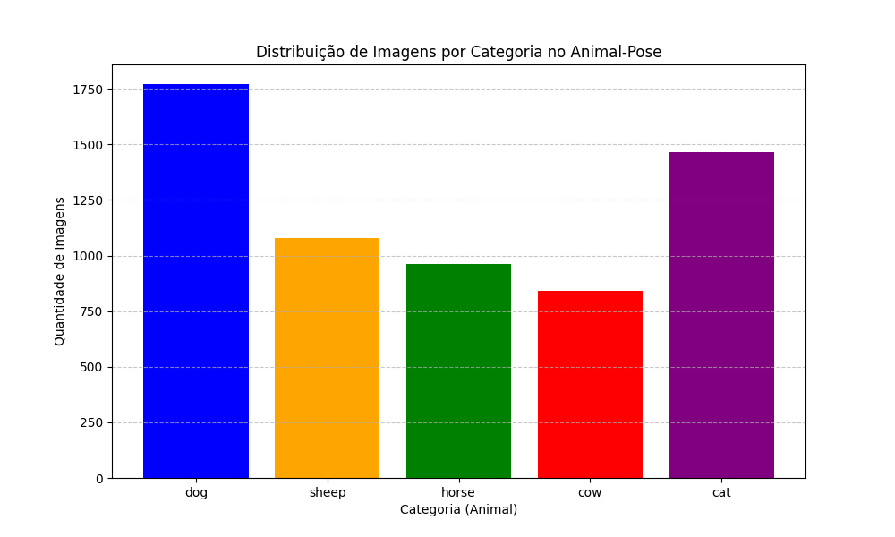
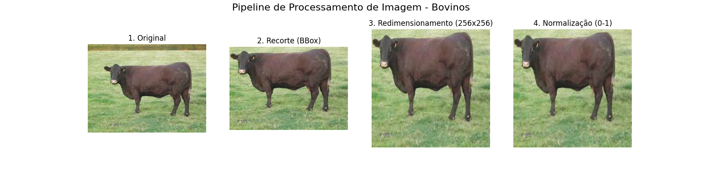

# pose-estimation-cows

# Pose Estimation para Bovinos

Este repositório contém a implementação da etapa de exploração, filtragem e processamento do **Animal-Pose Dataset**, com foco exclusivo em bovinos. O objetivo é preparar os dados para o treinamento de modelos de estimativa de pose aplicados à pecuária.

## 1. Análise Exploratória (EDA)

O dataset Animal-Pose contém imagens e anotações de *keypoints* e *bounding boxes* para 5 categorias de animais: cachorros, gatos, vacas (bovinos), ovelhas e cavalos. 

Na nossa análise exploratória, verificamos a distribuição das imagens para entender o balanceamento dos dados. 

*Descrição:* O gráfico de barras acima mostra a distribuição total de instâncias por classe. Identificamos que o dataset não é perfeitamente balanceado. Após realizar a contagem, extraímos que existem 200 imagens de bovinos** disponíveis, o que nos dá a base para a próxima fase.

## 2. Filtragem e Pipeline de Processamento

Para o nosso caso de uso (focado na pecuária), descartamos as imagens de outros animais e carregamos apenas os dados da classe `cow`. Como modelos de *pose estimation* (como HRNet ou ResNet) exigem entradas padronizadas, aplicamos o seguinte pipeline de visão computacional em cada imagem filtrada:

1. **Carregamento:** Leitura da imagem e conversão de BGR (padrão do OpenCV) para RGB.
2. **Recorte (Crop):** Utilizamos as coordenadas da *Bounding Box* fornecidas no dataset para isolar o bovino do fundo desnecessário.
3. **Redimensionamento (Resize):** Padronizamos a imagem recortada para a resolução de `256x256` pixels.
4. **Normalização:** Escalamos os valores dos pixels de `[0, 255]` para o intervalo `[0, 1]` dividindo por 255, facilitando a convergência matemática de futuras redes neurais.

Abaixo, a figura ilustra o passo a passo de uma imagem passando por esse pipeline:

## 3. Resultados do Processamento

Após executar o pipeline de dados, obtivemos uma base de dados limpa, contendo estritamente as matrizes numéricas correspondentes aos bovinos. 

**Resumo dos Resultados:**
* **Total de imagens brutas processadas:** 200
* **Resolução final padronizada:** 256x256 pixels com 3 canais de cor (RGB).
* **Formato de saída:** Tensores numéricos (float32) com valores normalizados entre 0 e 1, prontos para serem inseridos em *DataLoaders* do PyTorch ou TensorFlow.
* **Integridade dos dados:** O recorte via bounding box garantiu que o animal ocupe a maior parte do frame, reduzindo o ruído de fundo que poderia confundir a rede neural na detecção das articulações (*keypoints*).

## 4. Conclusões e Trabalhos Futuros

**Principais Aprendizados:**
Durante o desenvolvimento desta frente, ficou claro que a preparação dos dados é tão crítica quanto a arquitetura do modelo. O recorte preciso baseado nas anotações de *bounding box* melhorou significativamente a centralização do alvo, algo essencial para estimativa de pose. Além disso, lidar com anotações complexas em JSON exigiu uma boa estruturação lógica para não perder o mapeamento entre *imagem* e *keypoints*.

**Limitações do Trabalho:**
A principal limitação é o tamanho e a variabilidade da classe de bovinos dentro do dataset original. Muitas imagens apresentam oclusões (animais atrás de cercas ou no meio do rebanho) ou iluminação desafiadora. Além disso, a conversão de *keypoints* após o redimensionamento e o recorte da imagem exige um cálculo matemático rigoroso para que as anotações continuem batendo com a imagem nova.

**Sugestões de Trabalhos Futuros:**
1. **Data Augmentation:** Implementar rotações, espelhamento horizontal e variação de brilho para aumentar artificialmente o volume de dados de bovinos e tornar o modelo mais robusto.
2. **Treinamento de um Modelo:** Alimentar os tensores gerados em uma arquitetura como a HRNet (High-Resolution Network) ou DeepLabCut.
3. **Acompanhamento Temporal:** Tentar aplicar o modelo em vídeos frame a frame (como num sistema de CFTV de fazenda) para analisar padrões de locomoção e detectar claudicação (manqueira) nos animais.
